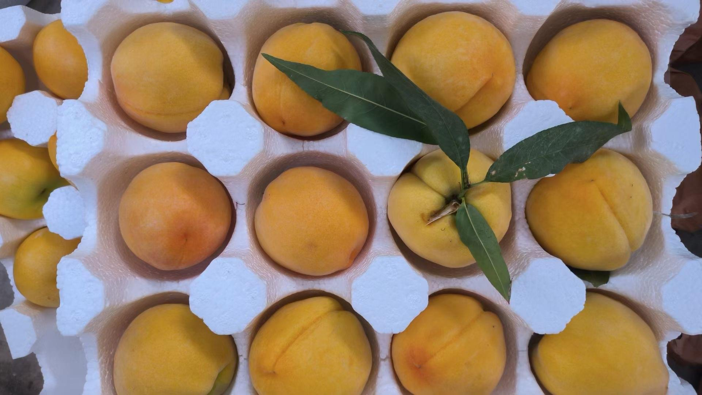
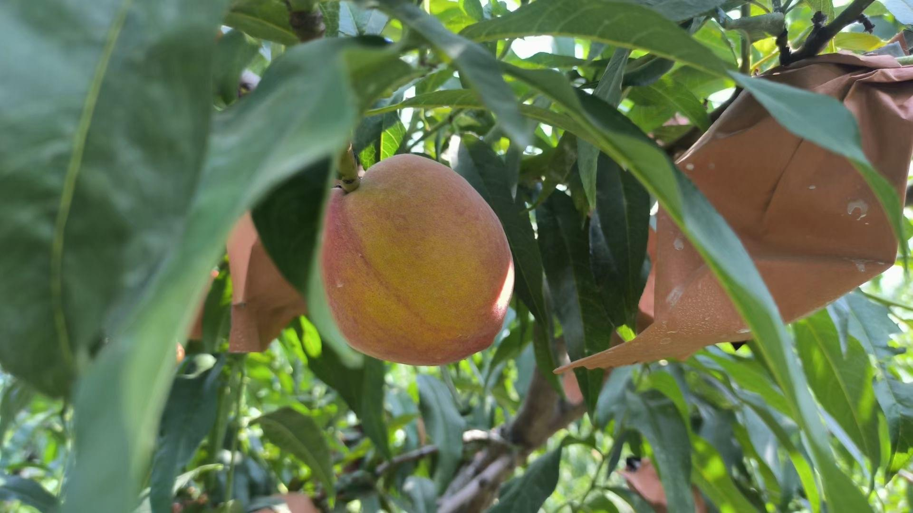
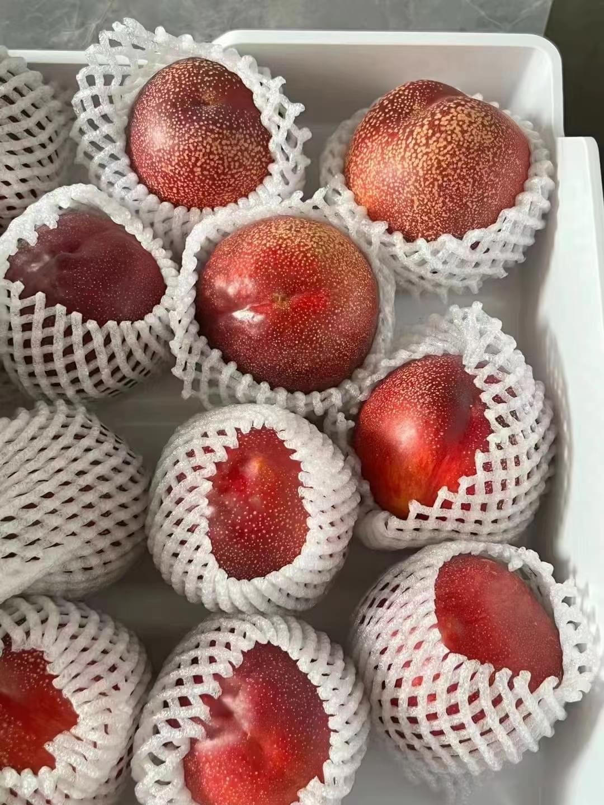

<b>
纹图 -  后期重点维护
</b>

- [软件下载地址（纹图 - 大小 \< 100M）](#软件下载地址纹图---大小--100m)
- [纹图Plus](#纹图plus)
- [通用安装指南](#通用安装指南)
- [功能汇聚](#功能汇聚)
- [半智能抠图教程(此教程仅适用-半智能抠图选项)](#半智能抠图教程此教程仅适用-半智能抠图选项)
- [注意事项](#注意事项)
- [试用激活码，可用数量2](#试用激活码可用数量2)
- [版本记录](#版本记录)
- [防丢失](#防丢失)

#### 软件下载地址（纹图 - 大小 < 100M）
- 蓝奏云（访问网页直接下载，勿转存）
- [https://wwzn.lanzouw.com/b02rca15i](https://wwzn.lanzouw.com/b02rca15i) 密码:6i3e

#### 纹图Plus
[纹图Plus - 纹图升级版，支持无损放大，前往查看](./plusinfo.md)

#### 通用安装指南
[查看](../../univer/install.md)

#### 功能汇聚
- 抠图（使用时可自由选择）
  - removebg海量抠图
  - 优质抠图
  - 高清抠图
  - removebg半智能抠图
- 无损放大
  - 图扩
- 无损压缩
  - TinyPNG官方无限速
  - 优速压图
- 其他音视频及图片处理功能...

#### 半智能抠图教程(此教程仅适用-半智能抠图选项)
[查看](../../../out/tutor/mer/index.md)

#### 注意事项
- 对于removebg抠图项（海量和半智能），尺寸/分辨率较大时可能出现边缘虚化，若虚化导致效果不佳，建议裁剪掉边缘富余区域再抠图，可以提升抠图效果
- 海量抠图：锯齿虚化选项——可降低锯齿感，但边缘虚化程度会略微加深

#### 试用激活码，可用数量2
- frPim381k6wS3dvz3LaOp38qCx3VIda2vOn04E0PMDjdM7x81GutQEOG8606cb3c

#### 版本记录
[查看](./version.md)

#### 防丢失
<!-- - 微信号：mtreeah -->
- 公众号：生长之树

<!-- #### 助农小广告
- 水果之乡砀山露天黄金蜜桃，油桃（朋友自家种植），每日新鲜采摘快递发货（江浙沪皖隔日达），有意者请添加（无意请忽略）
- 微信：wxid_2i4lgmc5hqzj22
- 微信名：绿意盎然

<video id="video" controls="" preload="none" poster="" width="600px">
      <source id="mp4" src="../../../assets/ad/dangshan/4.MP4" type="video/mp4">
</video> -->
