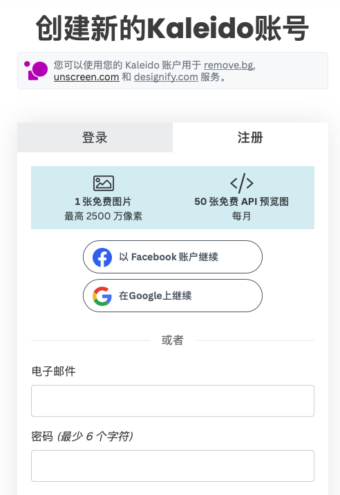
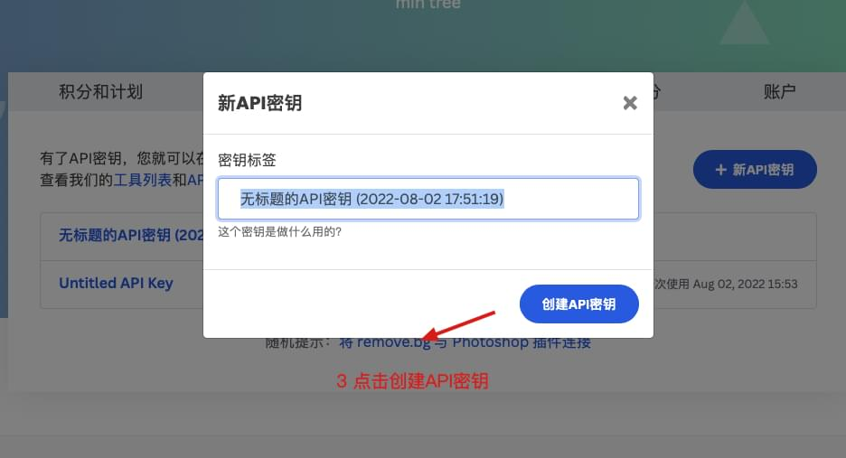

<b>
智能抠图使用指南
</b>

- [使用指南](#使用指南)
  - [1. 输入激活码(卡密/激活码在发货单中)，请用快捷键复制粘贴，或选中激活码拖进输入框，点立刻激活](#1-输入激活码卡密激活码在发货单中请用快捷键复制粘贴或选中激活码拖进输入框点立刻激活)
  - [2. 注册获取API密钥（有邮箱即可,无额外费用）](#2-注册获取api密钥有邮箱即可无额外费用)
  - [3. 注册成功后登录，打开我的账户(右上角)](#3-注册成功后登录打开我的账户右上角)
  - [4. 切换到 API密钥栏](#4-切换到-api密钥栏)
  - [5. 点击创建API密钥](#5-点击创建api密钥)
  - [6. 生成并复制API密钥](#6-生成并复制api密钥)
  - [7. 在软件中增加API密钥框中，输入获取的API密钥，点击增加（每个API密钥仅需配置一次）](#7-在软件中增加api密钥框中输入获取的api密钥点击增加每个api密钥仅需配置一次)
  - [8. 拖入待处理的文件或所在文件夹，点击开始抠图](#8-拖入待处理的文件或所在文件夹点击开始抠图)
- [注意事项](#注意事项)

### 使用指南
#### 1. 输入激活码(卡密/激活码在发货单中)，请用快捷键复制粘贴，或选中激活码拖进输入框，点立刻激活

#### 2. 注册获取API密钥（有邮箱即可,无额外费用）   
[removebg官网中文版注册地址](https://accounts.kaleido.ai/users/sign_up?locale=zh)   

#### 3. 注册成功后登录，打开我的账户(右上角)    

#### 4. 切换到 API密钥栏

#### 5. 点击创建API密钥

#### 6. 生成并复制API密钥

#### 7. 在软件中增加API密钥框中，输入获取的API密钥，点击增加（每个API密钥仅需配置一次）

#### 8. 拖入待处理的文件或所在文件夹，点击开始抠图

### 注意事项
1. ★ 每增加一个不同邮箱注册的新API密钥，月度可用数量会增加50张，欲达月度上限200张，需用4个不同邮箱注册，每个API密钥仅需配置一次
2.   ★ 不要生成多个API密钥，一个邮箱的可用数量50张，不会因为多生成几个API密钥而增长，不要在软件中输入同一个邮箱产生的多个API密钥，会相互干扰
3. 月度数量刷新时间取决于账号注册时间，而非月初
4. 图片中抠图目标占据图片最大空间时，可达较佳的抠图效果，若边缘富余区域较大，可在抠图前将图片主体目标边缘裁剪掉
5.  购买后体验如果不满意可以选择退款（退款理由请选择"其他"），退款后激活码会随之失效