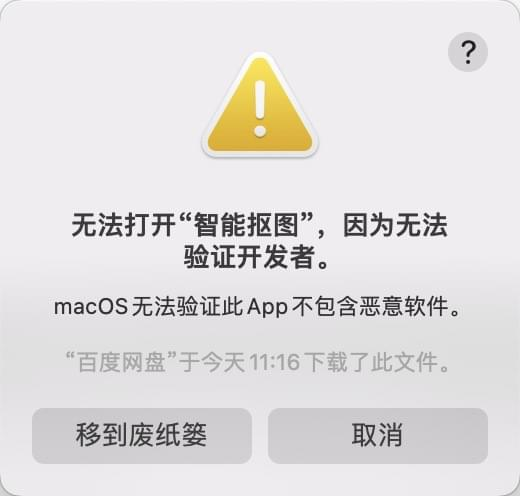
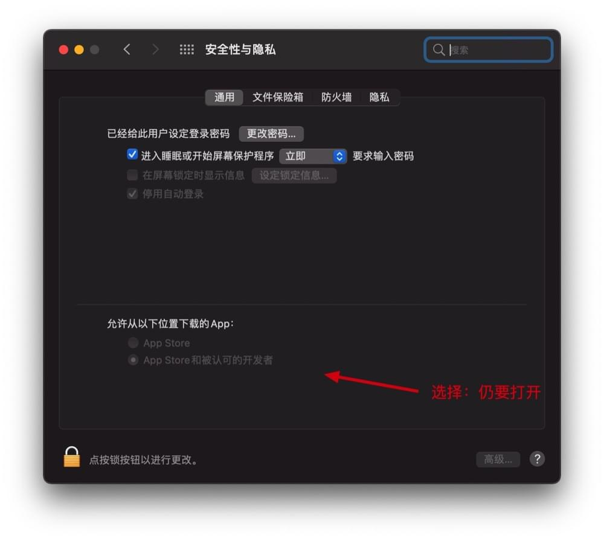

<b>
通用安装指南
</b>

- [Windows系统](#windows系统)
- [苹果MacOS系统](#苹果macos系统)

#### Windows系统
1. 下载后缀为zip或exe的安装文件并安装
2. Win11系统若无法安装，点击exe安装文件无响应，右击exe-属性-解除锁定，

#### 苹果MacOS系统
1. 下载后缀为dmg的安装文件并安装
2. Mac版本打开时若提示：无法打开，因为无法验证开发者，请点击取消，并前往：系统偏好设置-安全性与隐私-通用-仍要打开

