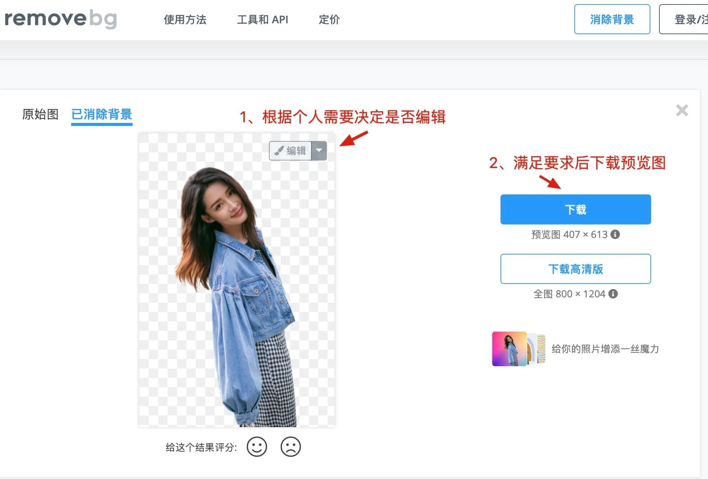
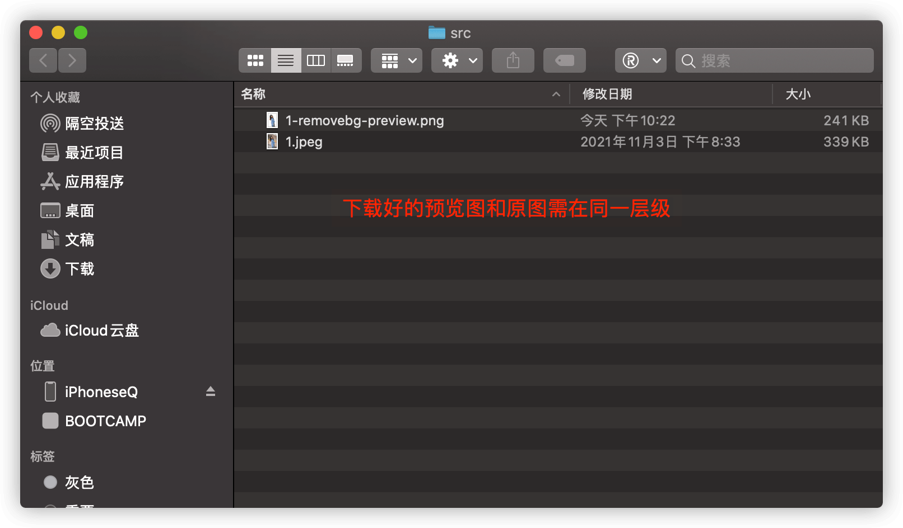
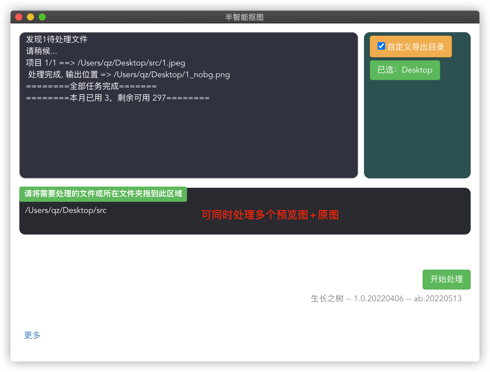

# 半智能抠图使用说明

### 1. 下载软件安装，在打开的工具中输入激活码，点立刻激活
### 2. 抠图步骤

a. 将待处理的原图，<red>（原图文件名最好不含特殊字符或空格，避免后续要修改）</red>，在removebg官网[https://www.remove.bg/zh](https://www.remove.bg/zh)，进行抠图操作，<red>不可进行添加背景色/原图或其他效果样式</red>，完成后下载预览图

<!-- 
 -->
b. 将所有待处理的原图及预览图<red>(预览图文件名需含后缀-removebg-preview，且名称前半部分需与原图名称一致)</red>一起拖入软件中指定区域，点击开始处理
<!--  -->

### 3. 注意事项
- 过大尺寸原图，可能导致原图读取失败或者抠图效果不佳，可以的话建议控制原图尺寸
- 原图中抠图目标占据原图最大空间时，可达较佳的抠图效果
- 当出现抠图效果不佳时，例如输出图边缘羽化/虚化，通常是由于原图尺寸因素引起，有两种办法可以改善
   1.  将原图尺寸降低为自己可以接受的较低的尺寸
   2.  将原图抠图目标边缘裁剪掉，使目标占据原图最大空间
   3.  然后再次尝试抠图  
  

