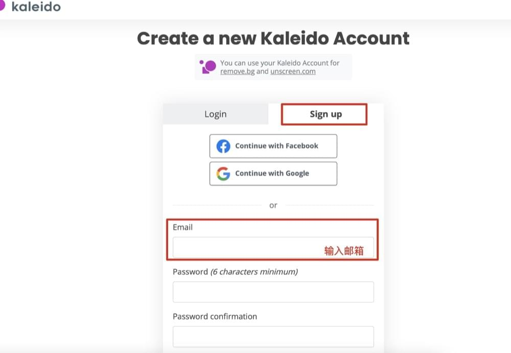
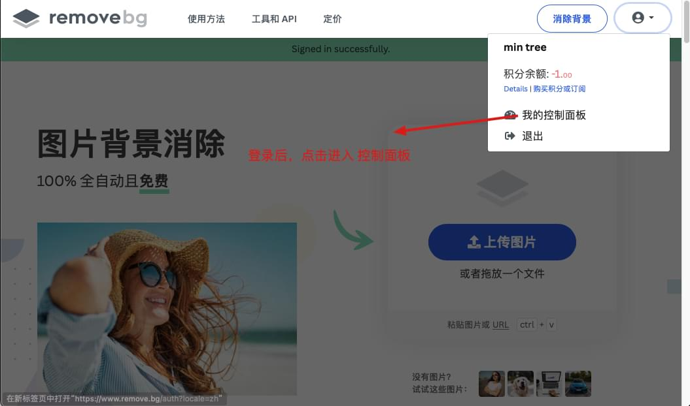
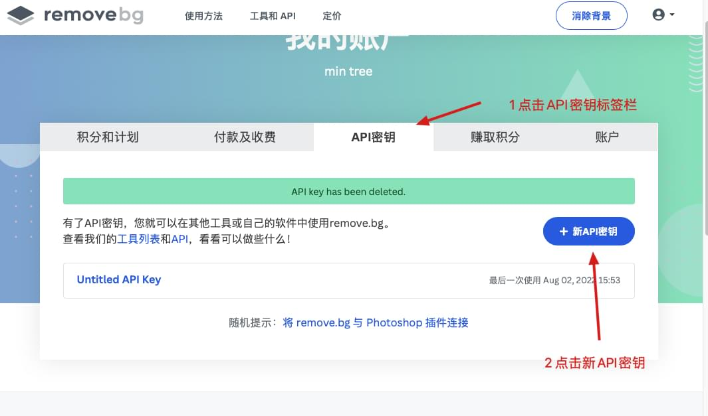
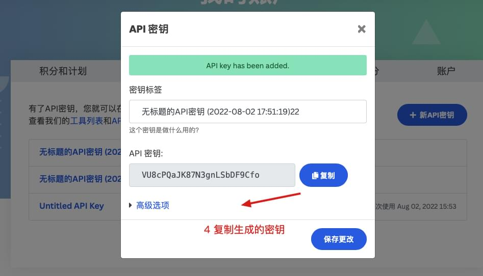
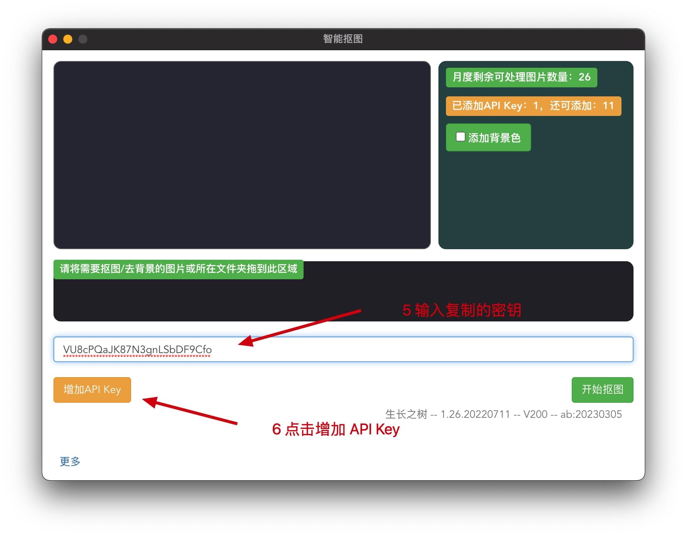
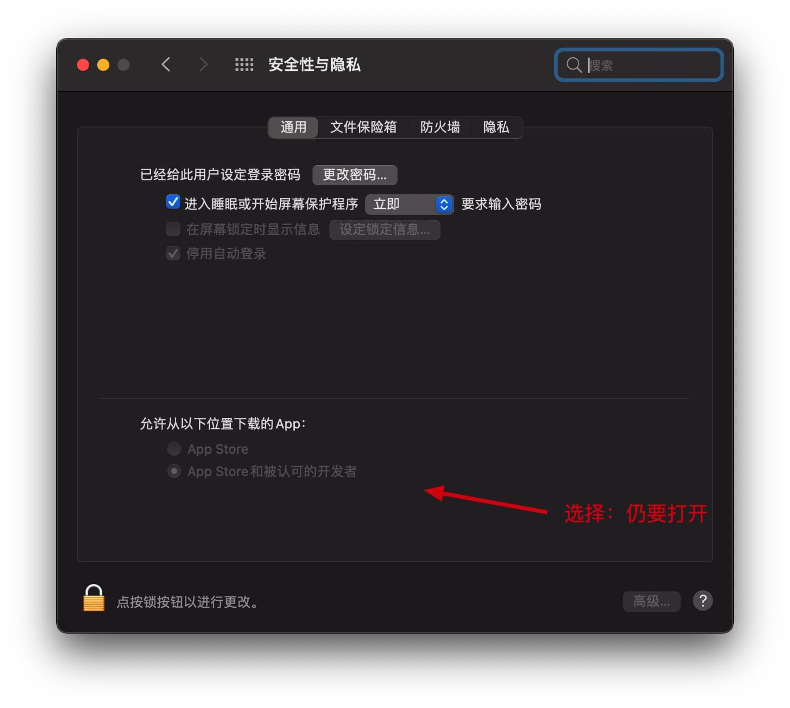

# 抠图工具使用教程

### 1. 下载软件安装，打开软件，输入激活码(激活码在发货单中)，请用快捷键复制粘贴，可选中激活码拖进输入框，点立刻激活（请保存好您的激活码）
### 2. 注册获取Removebg API密钥（有邮箱即可,无额外费用），注册成功后登录账户，登录成功后打开控制面板，切换到 API密钥栏，点击创建API密钥，即可生成并复制API密钥
注册地址:
[https://accounts.kaleido.ai/users/sign_up](https://accounts.kaleido.ai/users/sign_up)   
或访问中文版地址，点击右上方按钮注册：
[https://www.remove.bg/zh](https://www.remove.bg/zh)

注册成功后，登录并打开 控制面版

### 3. 在工具中增加API Key框中，输入获取的API Key，点击增加（每个API Key仅需配置一次）

### 4. 拖入待处理的文件或文件夹，点击开始抠图
### 5. 注意事项
1. Mac版本初次使用请使用右键弹出菜单后选择打开
2. Mac版本若出现下方问题，请打开 系统偏好设置-安全性与隐私-通用-任要打开

1. ★★★ 每增加一个不同邮箱注册的新API Key，月度可用数量会增加50张，欲达月度上限200张，需用4个不同邮箱注册，每个API Key仅需配置一次，可添加的总API Key数量有限
2.   ★★★ 在个人中心不要生成多个API Key，一个邮箱的可用数量50张，不会因为多生成几个API Key而增长，不要在软件中输入同一个邮箱产生的多个API key，会相互干扰
3. 月度数量刷新时间取决于账号注册时间，而非月初
4. 过大尺寸图片，可能导致图片读取失败或者抠图效果不佳，可以的话建议控制图片尺寸
5. 图片中抠图目标占据图片最大空间时，可达较佳的抠图效果
6. 当出现抠图效果不佳时，例如图片边缘羽化/虚化，通常是由于图片尺寸因素引起，有两种办法可以改善
   1.  将图片尺寸降低为自己可以接受的较低的尺寸
   2.  将图片抠图目标边缘裁剪掉，使目标占据图片最大空间
   3.  然后再次尝试抠图  
7.  购买后体验如果不满意可以选择退款（退款理由请选择"其他"），退款后激活码会随之失效
   

